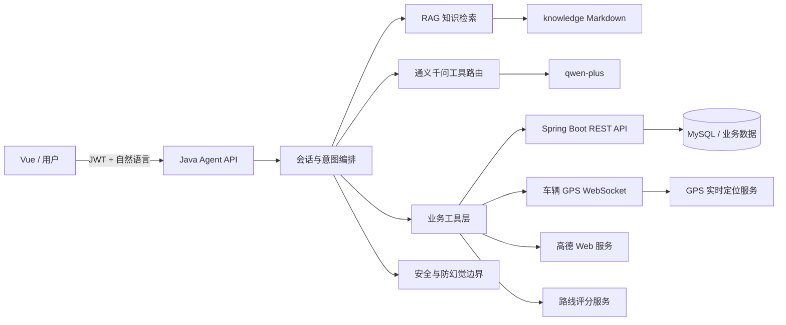

# 7. 智能体开发说明

> 负责人：智能体负责人  
> 适用项目：智慧物流智能体  
> 当前实现：Java 轻量服务、通义千问工具路由、RAG 知识问答、云端业务工具、多仓库写操作、路线推荐、实时 GPS、ETA、告警与通知查询  
> 当前云端地址：`http://111.170.148.177:58081`

## 7.1 智能体总体架构

### 7.1.1 建设目标

智慧物流智能体用于把自然语言问题转换为可审计、可鉴权的物流业务查询或操作。系统既能回答物流知识问题，也能在用户授权范围内调用 Spring Boot 业务接口查询或写入真实数据。

核心目标如下：

1. 为司机、仓库管理员、调度员、货主等角色提供统一对话入口；
2. 对知识类问题采用 RAG，减少模型无依据回答；
3. 对车辆、货物、运输任务、ETA、告警、通知等实时业务问题调用后端接口；
4. 对新增车辆、绑定司机、货物入库等写操作实施角色校验、参数校验和幂等保护；
5. 对实时 GPS、ETA 和路线推荐返回结构化 `toolData`，便于 Vue 端展示地图、卡片和列表；
6. 在模型或后端不可用时明确降级，不使用模型编造实时业务数据。

### 7.1.2 技术结构



### 7.1.3 核心模块

| 模块 | 主要职责 |
|---|---|
| `Application` | HTTP 服务启动、路由注册、CORS、统一错误响应 |
| `LogisticsAgent` | 对话编排、会话上下文、RAG/模型/工具结果整合 |
| `QwenToolRouter` | 使用千问识别用户意图并提取结构化参数 |
| `KnowledgeBase` | 加载、切分、检索本地知识文档 |
| `ModelClient` | 调用兼容 Chat Completions 或 Responses 的模型接口 |
| `BusinessDataService` | 业务工具调度、业务 REST 调用、实时位置和 ETA 结果封装 |
| `ReadOnlyBusinessTools` | 车辆、货物、运输任务、告警、通知等只读工具 |
| `WarehouseWriteTools` | 新增车辆、绑定司机、货物入库及仓库管理员权限控制 |
| `RealtimeVehicleService` | JWT WebSocket、心跳、重连、位置消息解析和缓存 |
| `AmapPlaceService` | 地址正向解析、逆地理编码、附近标志性位置描述 |
| `RouteRecommendationService` | 多目标路线评分、排序及推荐解释 |
| `InitialRouteRecommendationService` | 创建订单阶段的初始路线评分与推荐 |

### 7.1.4 请求处理流程

```text
POST /api/chat
  ↓
解析 sessionId、question 和 Authorization
  ↓
读取最近会话上下文
  ↓
写操作确定性识别 / 千问结构化工具路由 / 本地兜底路由
  ↓
┌─ 知识问题：RAG 检索 → 千问生成有依据回答
├─ 只读业务：调用后端 GET 接口 → 格式化真实结果
├─ 写操作：校验 WAREHOUSE_MANAGER → 校验参数 → POST/PUT
├─ 实时位置：WebSocket 缓存 → 单车 REST → 批量快照 → 旧接口
└─ 未接入实时能力：guardrail 明确拒绝编造
  ↓
返回 answer、mode、sources、toolData
```

### 7.1.5 运行模式

| `mode` | 含义 |
|---|---|
| `model` | 使用检索上下文和模型生成回答 |
| `extractive` | 未启用模型，直接返回知识片段 |
| `no_context` | 无足够知识依据且模型不可用 |
| `tool` | 已调用业务工具并返回真实数据或操作结果 |
| `guardrail` | 实时数据工具不可用、权限不足或问题超出安全边界 |

## 7.2 RAG / 知识库

### 7.2.1 知识来源

知识文件位于：

```text
knowledge/
```

当前主要文档包括：

- 系统管理指南；
- 调度操作指南；
- 车辆管理；
- 物流术语表；
- 异常告警处理；
- 平台使用指南；
- 常见问题 FAQ；
- 角色与权限说明；
- 司机操作指南。

支持 UTF-8 Markdown 和文本文件。应用启动时加载知识文件并切分为可检索片段。

### 7.2.2 检索策略

本地检索兼容：

- 中文字符；
- 中文二元词组；
- 英文单词和业务编号；
- 文档标题与正文内容。

默认召回数量由以下变量控制：

```text
RAG_TOP_K=4
```

检索结果在响应的 `sources` 中返回：

```json
{
  "sources": [
    {
      "source": "异常告警处理.md",
      "score": 8.215
    }
  ]
}
```

### 7.2.3 RAG 与模型协同

知识类问题的模型输入由以下内容组成：

1. 系统约束；
2. 最近对话上下文；
3. 检索到的知识片段；
4. 用户当前问题。

模型必须优先使用知识库事实。知识库未命中时，只允许回答通用物流知识，不允许伪造车辆位置、任务状态、ETA、告警或数据库记录。

### 7.2.4 在线知识导入

接口：

```http
POST /api/knowledge
X-Admin-Token: <ADMIN_TOKEN>
Content-Type: application/json
```

请求示例：

```json
{
  "title": "签收规则",
  "content": "货物送达后，货主核对货物并确认签收。"
}
```

未配置 `ADMIN_TOKEN` 时，该写接口默认关闭。API Key、JWT、密码不得写入知识库。

## 7.3 智能问答

### 7.3.1 对话接口

```http
POST /api/chat
Authorization: Bearer <业务JWT>
Content-Type: application/json; charset=UTF-8
```

请求：

```json
{
  "sessionId": "vue-user-001",
  "question": "sim_003 现在在哪里？"
}
```

响应：

```json
{
  "sessionId": "vue-user-001",
  "answer": "车辆 sim_003 当前位于……",
  "mode": "tool",
  "sources": [],
  "toolData": {
    "tool": "realtime_vehicle_websocket",
    "available": true,
    "sourceType": "BACKEND_WEBSOCKET",
    "data": {}
  }
}
```

### 7.3.2 身份和权限

Vue 必须把用户登录后取得的业务 JWT 原样转发给智能体。智能体不会接受前端自行声明的角色，而是调用：

```http
GET /api/v1/users/me
```

以业务后端返回的角色作为权限依据。

当前写操作仅允许：

```text
WAREHOUSE_MANAGER
```

司机、货主或调度员尝试写入时，由智能体和业务后端共同拒绝。

### 7.3.3 会话管理

`sessionId` 用于关联同一轮连续对话。前端应满足：

- 同一对话窗口复用同一个 `sessionId`；
- 点击“新对话”时生成新 ID；
- 不把 JWT、密码或 API Key 放入 `sessionId`；
- 多用户不得共享同一个固定会话 ID。

### 7.3.4 防幻觉规则

以下问题必须调用业务工具：

- 车辆当前位置、速度、轨迹；
- 车辆司机、状态、仓库；
- 货物和运输任务详情；
- ETA；
- 告警、通知和调度指令；
- 新增车辆、绑定司机、入库等写操作。

工具失败时应返回真实错误或“暂未收到数据”，不得由模型补造。

## 7.4 路线评分与决策辅助

### 7.4.1 功能定位

路线评分属于独立的决策辅助接口，与普通 Chat 共用同一 Java 服务。后端负责产生候选路线、天气和路况数据；智能体负责多目标评分、排序和可解释推荐。

### 7.4.2 路线评分接口

```http
POST /api/route-recommendations/score
Content-Type: application/json
```

用于对后端提供的候选路线进行综合评分。评分维度包括但不限于：

- 距离；
- 预计耗时；
- 拥堵程度；
- 天气风险；
- 收费与运输成本；
- 路线稳定性；
- 业务风险和解释信息。

### 7.4.3 初始路线推荐接口

```http
POST /api/route-recommendations/initial
Content-Type: application/json
```

用于 Vue 创建订单页面的多路线推荐。当前规则版本可通过 `/health` 查看：

```json
{
  "initialRouteScoringEnabled": true,
  "initialRouteScoringRuleVersion": "agent-initial-route-score-v1"
}
```

### 7.4.4 天气和路况数据边界

智能体不直接伪造天气或路况。输入应来自后端已接入的高德接口，并明确时间、路段和数据状态。当高德数据缺失时，评分结果必须标记数据不完整，不能把缺失值解释为“道路畅通”或“天气良好”。

### 7.4.5 推荐结果使用原则

- 推荐是决策辅助，不代表自动下发路线；
- 前端应展示评分、排序、推荐原因和风险；
- 后端是候选路线和业务约束的事实来源；
- 前端不得重新计算并覆盖智能体推荐顺序；
- 资源状态变化或接口返回 409 时，应重新获取候选数据，不应重复提交旧请求。

## 7.5 Agent 工具调用与输入输出

### 7.5.1 只读工具

| 能力 | 典型工具/数据接口 |
|---|---|
| 当前用户 | `/api/v1/users/me` |
| 车辆列表与档案 | `/api/v1/vehicles` |
| 车辆实时位置 | GPS WebSocket、单车最新位置、批量快照 |
| 车辆历史轨迹 | 任务轨迹、车辆 location-history |
| 货物列表与详情 | `/api/v1/cargos`，按 `cargoNo` 匹配 |
| 运输任务与 ETA | `/api/v1/transport-tasks`，按 `taskNo` 或 ID 查询 |
| 规划路线 | `/api/v1/transport-tasks/{id}/planned-route` |
| 告警 | `/api/v1/alarms` |
| 通知 | `/api/v1/notifications`、未读列表和未读数量 |
| 调度指令 | `/api/v1/dispatch-commands` |
| 运营概览 | 聚合车辆、货物、任务、告警和通知结果 |

### 7.5.2 写操作工具

#### 新增车辆

必须提供：

```text
plateNumber
simCode，格式 ^sim_\d{3}$
vehicleType：TRUCK / VAN / REFRIGERATED
capacity，单位公斤
warehouseId / warehouseName / warehouseNo 至少一个
```

调用：

```http
POST /api/v1/vehicles
```

#### 绑定司机

车辆可使用 `vehicleId`、车牌或 SIM 指定；司机可使用 `driverId` 或唯一姓名指定。

```http
PUT /api/v1/vehicles/{vehicleId}/driver
```

```json
{
  "driverId": 12
}
```

#### 货物入库

必须提供：

```text
cargoNo
cargoName
weight，单位公斤
volume，单位立方米
cargoTypeId / cargoTypeName 至少一个
warehouseId / warehouseName / warehouseNo 至少一个
```

调用：

```http
POST /api/v1/cargos
```

### 7.5.3 写操作安全

所有写操作实施以下控制：

1. 必须携带业务 JWT；
2. 调用 `/users/me` 验证 `WAREHOUSE_MANAGER`；
3. 写入前解析并验证车辆、司机、仓库、货物种类等引用；
4. 缺少字段时返回 `requiresInput=true`，不发送后端写请求；
5. 使用参数摘要生成幂等键；
6. 业务后端执行最终 RBAC 和唯一性校验；
7. 409 等冲突不得由前端盲目自动重试。

### 7.5.4 实时 GPS 输入兼容

WebSocket：

```text
ws://111.170.148.177:58080/ws/vehicle-locations?token=<JWT>
```

支持顶层对象、数组、`gps`、`data`、`data.gps`，以及以下别名：

```text
经度：longitude / lon / lng
纬度：latitude / lat
车辆：vehicleId / vehicle_id
设备：simCode / sim_code / deviceId / device_id
时间：collectedAt / timestamp / collectTime
坐标系：coordinateSystem / coordSystem
```

查询优先级：

```text
WebSocket 内存缓存
→ GET /api/v1/vehicles/{vehicleId}/location/latest
→ GET /api/v1/vehicles/locations/latest
→ 旧版 by-sim-code 接口
```

### 7.5.5 结构化输出约定

业务工具结果通过 `toolData` 输出，Vue 应优先使用结构化字段，不要从 `answer` 文本反向解析经纬度、任务 ID 或列表数据。

通用字段：

```json
{
  "tool": "工具名称",
  "sourceType": "数据来源",
  "readOnly": true,
  "writeOperation": false,
  "available": true,
  "endpoint": "/api/...",
  "data": {}
}
```

## 7.6 Agent API

### 7.6.1 健康检查

```http
GET /health
```

成功示例：

```json
{
  "status": "UP",
  "knowledgeChunks": 17,
  "modelEnabled": true,
  "modelApiStyle": "chat_completions",
  "modelName": "qwen-plus",
  "businessDataEnabled": true,
  "businessApiBaseUrl": "http://111.170.148.177:58080/api/v1",
  "routeScoringEnabled": true,
  "routeScoringAlgorithmVersion": "route-score-v1",
  "initialRouteScoringEnabled": true,
  "initialRouteScoringRuleVersion": "agent-initial-route-score-v1"
}
```

服务在线的判断条件是：

```text
HTTP 200 且 status == UP
```

`modelEnabled=false` 代表进入检索模式，不等于服务离线。

### 7.6.2 Chat

```http
POST /api/chat
Authorization: Bearer <JWT>
Content-Type: application/json; charset=UTF-8
```

必填字段：

| 字段 | 类型 | 说明 |
|---|---|---|
| `sessionId` | string | 对话会话标识 |
| `question` | string | 用户问题，最大长度由 `MAX_QUESTION_LENGTH` 控制 |

### 7.6.3 路线评分

```http
POST /api/route-recommendations/score
POST /api/route-recommendations/initial
```

具体候选路线字段以路线联调文档为准。调用方必须保留后端路线 ID、天气和路况原始字段，便于追踪推荐依据。

### 7.6.4 知识导入

```http
POST /api/knowledge
X-Admin-Token: <ADMIN_TOKEN>
```

仅用于授权管理员导入知识；默认关闭。

### 7.6.5 CORS

当前服务允许：

```text
Access-Control-Allow-Origin: *
Access-Control-Allow-Methods: GET, POST, OPTIONS
Access-Control-Allow-Headers: Content-Type, Authorization, X-Admin-Token
```

生产环境建议改为明确的 Vue 域名，并通过 HTTPS 反向代理统一入口。

## 7.7 与业务后端的数据边界

### 7.7.1 事实来源

| 数据 | 权威来源 |
|---|---|
| 用户、角色、权限 | Spring Boot `/users/me` |
| 车辆、司机、仓库 | Spring Boot / MySQL |
| 货物、货物种类 | Spring Boot / MySQL |
| 运输任务、ETA、路线 | Spring Boot 任务与路线服务 |
| 实时位置 | GPS WebSocket 和位置 REST 快照 |
| 告警、通知、调度指令 | Spring Boot 对应业务模块 |
| 物流制度和操作规范 | 本地知识库 |
| 附近地点和地址解析 | 高德 Web 服务 |

智能体只负责编排、解释、参数提取和工具调用，不应成为业务主数据的第二份事实来源。

### 7.7.2 鉴权边界

- Vue 负责完成用户登录并持有 JWT；
- Vue 调用 Chat 时转发 JWT；
- 智能体使用 JWT 调用后端；
- 智能体服务账号仅用于自身 WebSocket 和必要的后台连接；
- 业务后端执行最终角色、数据范围和状态机校验；
- API Key、服务账号密码只允许进入服务器环境文件，不进入代码、知识库和日志。

### 7.7.3 多仓库边界

- 车辆创建必须绑定归属仓库 `warehouseId`；
- 货物入库必须绑定 `cargoTypeId` 和 `warehouseId`；
- `warehouseId` 表示归属/库存仓库，不表示车辆 GPS 实时位置；
- 仓库和货物种类由后端主数据接口提供；
- 智能体不创建、修改或删除仓库主数据；
- 多仓出库和智能选仓最终合同以业务后端 `/transport-tasks/from-warehouse` 为准。

### 7.7.4 异常与降级边界

| 场景 | 行为 |
|---|---|
| 千问不可用 | 使用确定性路由和本地检索，实时数据不编造 |
| 业务 API 401 | 提示重新登录 |
| 业务 API 403 | 提示权限不足 |
| 业务 API 409 | 返回业务冲突，不自动重复写入 |
| 业务 API 5xx/超时 | 标记工具不可用，可对只读请求做有限重试 |
| WebSocket 断开 | 指数退避重连，并使用 REST 最新位置兜底 |
| 高德不可用 | 保留经纬度，不编造附近地点 |
| 缺少写操作参数 | `requiresInput=true`，不执行后端写入 |

### 7.7.5 当前边界与后续演进

当前实现为单实例 Java 服务，会话和实时位置缓存在内存。多实例部署前需要补充：

- Redis 或数据库会话共享；
- 分布式实时位置缓存；
- 请求限流和熔断；
- 模型和工具调用链路追踪；
- 写操作审计与审批；
- 更细粒度的数据范围授权；
- HTTPS、反向代理和受控 CORS；
- 自动化发布、回滚和监控告警。

