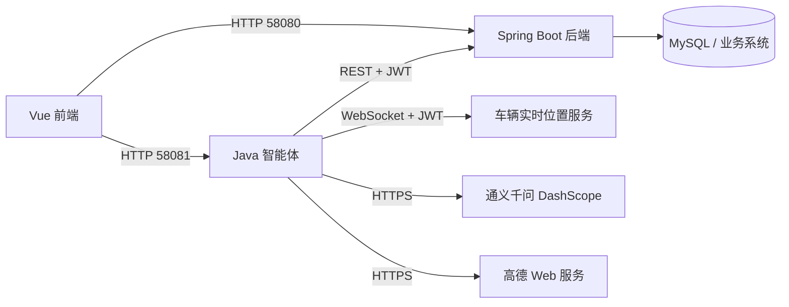

# 7. 智能体服务部署

> 负责人：智能体负责人  
> 适用服务：智慧物流 Java 智能体  
> 当前公网地址：`http://111.170.148.177:58081`  
> 当前 systemd 服务：`smart-logistics-agent.service`  
> 当前部署根目录：`/opt/smart-logistics-agent`

## 7.1 智能体运行环境与依赖

### 7.1.1 运行拓扑



### 7.1.2 本地开发环境

推荐环境：

| 依赖 | 要求 |
|---|---|
| 操作系统 | Windows 10/11 |
| PowerShell | 5.1 或更高 |
| JDK | JDK 21，至少包含 `java` 和 `javac` |
| 网络 | 可访问 DashScope、高德、云端 58080 |
| 编码 | UTF-8 |

验证：

```powershell
java -version
javac -version
```

编译：

```powershell
cd D:\smart_logistics
powershell -NoProfile -ExecutionPolicy Bypass -File .\scripts\build.ps1
```

编译产物：

```text
D:\smart_logistics\out
```

本地启动：

```powershell
java "-Dfile.encoding=UTF-8" -cp ".\out" com.smartlogistics.agent.Application
```

PowerShell 中 `-Dfile.encoding=UTF-8` 必须整体加引号，否则可能被错误解析为 Java 主类。

### 7.1.3 云端运行环境

当前服务器：

```text
主机：111.170.148.177
SSH 端口：57959
运行用户：smartagent
Java：OpenJDK 21
HTTP 端口：58081
```

目录结构：

```text
/opt/smart-logistics-agent/
├── current -> releases/<当前版本>
└── releases/
    ├── <旧版本>
    └── <新版本>

/etc/smart-logistics-agent.env
/etc/systemd/system/smart-logistics-agent.service
```

单个 release 内容：

```text
<release>/
├── out/          Java class 编译产物
├── web/          智能体自带静态页面
└── knowledge/    RAG 知识库
```

### 7.1.4 网络依赖

| 方向 | 地址 | 用途 |
|---|---|---|
| Vue → Agent | `111.170.148.177:58081` | 健康检查、Chat、路线评分 |
| Agent → 后端 | `111.170.148.177:58080` | 业务 REST API |
| Agent → GPS | `ws://111.170.148.177:58080/ws/vehicle-locations` | 实时位置推送 |
| Agent → DashScope | `https://dashscope.aliyuncs.com` | 千问模型 |
| Agent → 高德 | `https://restapi.amap.com` | 地理编码和逆地理编码 |

生产环境建议使用 HTTPS/WSS 和反向代理。HTTPS 页面不能直接请求 HTTP Agent，否则浏览器会因 Mixed Content 判定服务不可用。

## 7.2 模型 / API Key / 知识库配置

### 7.2.1 配置原则

- API Key、JWT、用户名和密码不得写入代码；
- 不得提交到 Git；
- 不得写入知识库；
- 不得在健康接口和日志中输出完整密钥；
- 本地通过当前终端环境变量提供；
- 云端通过 `/etc/smart-logistics-agent.env` 提供；
- 环境变量修改后必须重启 Java 服务。

### 7.2.2 本地环境变量

#### 服务和业务后端

```powershell
$env:AGENT_PORT = "58081"
$env:BUSINESS_API_BASE_URL = "http://" + "111.170.148.177:58080"
$env:BUSINESS_API_TIMEOUT_MS = "30000"
$env:REALTIME_WS_URL = "ws://" + "111.170.148.177:58080/ws/vehicle-locations"
```

#### 千问

```powershell
$secureKey = Read-Host "请输入千问 DashScope API Key" -AsSecureString
$env:MODEL_API_KEY = [System.Net.NetworkCredential]::new("", $secureKey).Password
Remove-Variable secureKey

$env:MODEL_API_STYLE = "chat_completions"
$env:MODEL_BASE_URL = "https://dashscope.aliyuncs.com/compatible-mode/v1"
$env:MODEL_NAME = "qwen-plus"
```

#### 高德

```powershell
$secureAmapKey = Read-Host "请输入高德 Web 服务 Key" -AsSecureString
$env:AMAP_WEB_SERVICE_KEY = [System.Net.NetworkCredential]::new("", $secureAmapKey).Password
Remove-Variable secureAmapKey

$env:AMAP_GEOCODE_URL = "https://restapi.amap.com/v3/geocode/geo"
$env:AMAP_REVERSE_GEOCODE_URL = "https://restapi.amap.com/v3/geocode/regeo"
```

#### 后端服务账号

```powershell
$credential = Get-Credential -Message "请输入智能体后端服务账号"
$env:BUSINESS_API_USERNAME = $credential.UserName
$env:BUSINESS_API_PASSWORD = $credential.GetNetworkCredential().Password
Remove-Variable credential
Remove-Item Env:BUSINESS_API_TOKEN -ErrorAction SilentlyContinue
```

服务账号用于智能体自身连接 GPS WebSocket 和必要的后台接口。Chat 业务查询仍应优先使用 Vue 转发的当前用户 JWT。

### 7.2.3 云端环境文件

文件：

```text
/etc/smart-logistics-agent.env
```

示例模板：

```ini
AGENT_PORT=58081
KNOWLEDGE_DIR=knowledge

MODEL_API_STYLE=chat_completions
MODEL_BASE_URL=https://dashscope.aliyuncs.com/compatible-mode/v1
MODEL_API_KEY=<通过安全方式填写>
MODEL_NAME=qwen-plus

BUSINESS_API_BASE_URL=http://111.170.148.177:58080/api/v1
BUSINESS_API_TIMEOUT_MS=30000
BUSINESS_API_USERNAME=<服务账号>
BUSINESS_API_PASSWORD=<服务密码>

REALTIME_WS_URL=ws://111.170.148.177:58080/ws/vehicle-locations

AMAP_WEB_SERVICE_KEY=<高德 Web 服务 Key>
AMAP_GEOCODE_URL=https://restapi.amap.com/v3/geocode/geo
AMAP_REVERSE_GEOCODE_URL=https://restapi.amap.com/v3/geocode/regeo

RAG_TOP_K=4
MAX_QUESTION_LENGTH=2000
```

建议权限：

```bash
sudo chown root:root /etc/smart-logistics-agent.env
sudo chmod 600 /etc/smart-logistics-agent.env
```

不要在交接文档中提交真实 `MODEL_API_KEY`、`AMAP_WEB_SERVICE_KEY` 或密码。

### 7.2.4 主要环境变量

| 变量 | 默认值/示例 | 说明 |
|---|---|---|
| `AGENT_PORT` | `8080`，云端为 `58081` | HTTP 端口 |
| `KNOWLEDGE_DIR` | `knowledge` | 知识库目录 |
| `MODEL_API_KEY` | 空 | 为空时进入检索模式 |
| `MODEL_API_STYLE` | `chat_completions` | 模型 API 协议 |
| `MODEL_BASE_URL` | DashScope compatible-mode | 模型根地址 |
| `MODEL_NAME` | `qwen-plus` | 模型名称 |
| `BUSINESS_API_BASE_URL` | 云端 58080 | 业务后端地址 |
| `BUSINESS_API_USERNAME` | 服务账号 | 后台登录和 WebSocket Token |
| `BUSINESS_API_PASSWORD` | 服务密码 | 不得输出到日志 |
| `BUSINESS_API_TOKEN` | 可选 | 固定 Token；通常使用账号动态登录 |
| `BUSINESS_API_TIMEOUT_MS` | `8000` | 后端连接与读取超时 |
| `REALTIME_WS_URL` | 车辆位置 WS | GPS 实时推送 |
| `AMAP_WEB_SERVICE_KEY` | 空 | 地址解析和附近地点 |
| `RAG_TOP_K` | `4` | 知识召回片段数 |
| `MAX_QUESTION_LENGTH` | `2000` | 问题长度限制 |
| `ADMIN_TOKEN` | 空 | 知识导入管理令牌 |

### 7.2.5 知识库部署

知识库和 class 文件一起进入 release：

```text
/opt/smart-logistics-agent/current/knowledge
```

更新知识库后应执行：

1. 本地确认 UTF-8 编码；
2. 重新打包 release；
3. 切换 `current`；
4. 重启服务；
5. 检查 `/health` 中 `knowledgeChunks`；
6. 使用至少一个知识问题验证召回来源。

## 7.3 服务启动与日志

### 7.3.1 systemd 服务文件

路径：

```text
/etc/systemd/system/smart-logistics-agent.service
```

当前配置基线：

```ini
[Unit]
Description=Smart Logistics Java Agent
After=network-online.target smart-logistics-backend.service
Wants=network-online.target

[Service]
Type=simple
User=smartagent
Group=smartagent
WorkingDirectory=/opt/smart-logistics-agent/current
EnvironmentFile=/etc/smart-logistics-agent.env
ExecStart=/usr/bin/java -Dfile.encoding=UTF-8 -cp /opt/smart-logistics-agent/current/out com.smartlogistics.agent.Application
Restart=on-failure
RestartSec=5
TimeoutStopSec=15
SuccessExitStatus=143
NoNewPrivileges=true
PrivateTmp=true
ProtectHome=true

[Install]
WantedBy=network-online.target
```

实际服务器中 `[Install]` 可使用：

```ini
WantedBy=multi-user.target
```

### 7.3.2 常用服务命令

```bash
sudo systemctl daemon-reload
sudo systemctl enable smart-logistics-agent.service
sudo systemctl start smart-logistics-agent.service
sudo systemctl restart smart-logistics-agent.service
sudo systemctl stop smart-logistics-agent.service
```

查看状态：

```bash
sudo systemctl status smart-logistics-agent.service --no-pager -l
```

只判断是否运行：

```bash
systemctl is-active smart-logistics-agent.service
```

预期：

```text
active
```

### 7.3.3 日志

最近日志：

```bash
sudo journalctl -u smart-logistics-agent.service -n 100 --no-pager
```

实时日志：

```bash
sudo journalctl -u smart-logistics-agent.service -f
```

本次启动日志：

```bash
sudo journalctl -u smart-logistics-agent.service -b --no-pager
```

正常启动应包含：

```text
智慧物流智能体已启动：http://localhost:58081
知识片段：17，模型：qwen-plus
云端业务数据：http://111.170.148.177:58080/api/v1
Realtime WebSocket connected: ws://111.170.148.177:58080/ws/vehicle-locations
```

### 7.3.4 版本化发布

推荐发布名：

```text
yyyyMMdd-HHmmss-功能说明
```

例如：

```text
20260901-123129-gps-multiwarehouse
```

本地打包：

```powershell
cd D:\smart_logistics
powershell -NoProfile -ExecutionPolicy Bypass -File .\scripts\build.ps1

$release = (Get-Date -Format "yyyyMMdd-HHmmss") + "-agent"
$archive = Join-Path $env:TEMP ($release + ".tar.gz")
tar -czf $archive out web knowledge
```

上传：

```powershell
scp -i "C:\Users\<用户>\.ssh\id_ed25519" -P 57959 `
    $archive `
    root@111.170.148.177:/tmp/
```

服务器发布步骤：

```bash
release=20260901-123129-agent
archive=/tmp/${release}.tar.gz
target=/opt/smart-logistics-agent/releases/${release}

sudo mkdir -p "$target"
sudo tar -xzf "$archive" -C "$target"
test -f "$target/out/com/smartlogistics/agent/Application.class"
sudo chown -R smartagent:smartagent "$target"

sudo ln -s "$target" /opt/smart-logistics-agent/current.next
sudo mv -Tf /opt/smart-logistics-agent/current.next /opt/smart-logistics-agent/current
sudo systemctl restart smart-logistics-agent.service
```

清理上传包：

```bash
rm -f "$archive"
```

### 7.3.5 回滚

发布前记录旧版本：

```bash
readlink -f /opt/smart-logistics-agent/current
```

回滚示例：

```bash
old=/opt/smart-logistics-agent/releases/<旧版本>
sudo ln -s "$old" /opt/smart-logistics-agent/current.rollback
sudo mv -Tf /opt/smart-logistics-agent/current.rollback /opt/smart-logistics-agent/current
sudo systemctl restart smart-logistics-agent.service
```

验证回滚：

```bash
systemctl is-active smart-logistics-agent.service
curl -fsS http://127.0.0.1:58081/health
```

不要在新版本启动失败时删除旧 release。

## 7.4 Agent API / 健康检查

### 7.4.1 服务器本机健康检查

```bash
curl -i --max-time 10 http://127.0.0.1:58081/health
```

预期：

```text
HTTP/1.1 200 OK
```

响应中的关键字段：

```json
{
  "status": "UP",
  "modelEnabled": true,
  "modelName": "qwen-plus",
  "businessDataEnabled": true,
  "routeScoringEnabled": true,
  "initialRouteScoringEnabled": true
}
```

### 7.4.2 公网健康检查

PowerShell：

```powershell
$agentBaseUrl = "http://" + "111.170.148.177:58081"
Invoke-RestMethod -Uri ($agentBaseUrl + "/health") -TimeoutSec 20
```

端口检查：

```powershell
Test-NetConnection 111.170.148.177 -Port 58081
```

预期：

```text
TcpTestSucceeded : True
```

### 7.4.3 Vue 在线状态判断

正确判断：

```javascript
const health = await getAgentHealth()
const online = health && health.status === 'UP'
```

不要错误判断：

```javascript
health.code === 200
```

因为 `/health` 的响应没有统一业务信封 `code` 字段。

也不要把：

```text
modelEnabled=false
```

判断为离线。它只代表模型未启用，服务仍可使用本地检索和确定性工具路由。

Vue 环境变量：

```ini
VITE_AGENT_BASE_URL=http://111.170.148.177:58081
```

修改 `.env` 后必须重新构建或重启 Vite。`VITE_*` 在构建时注入，不能只修改服务器上的文本文件而不重新构建前端。

### 7.4.4 Chat 检查

```powershell
$body = @{
    sessionId = "deploy-check"
    question  = "我是谁？"
} | ConvertTo-Json

Invoke-RestMethod `
    -Uri "http://111.170.148.177:58081/api/chat" `
    -Method Post `
    -Headers @{ Authorization = "Bearer $token" } `
    -ContentType "application/json; charset=UTF-8" `
    -Body ([System.Text.Encoding]::UTF8.GetBytes($body)) `
    -TimeoutSec 60
```

### 7.4.5 实时位置检查

```text
sim_003 现在在哪里？
```

成功结果应满足：

```text
mode = tool
toolData.tool = realtime_vehicle_websocket
toolData.available = true
```

位置来源可能为：

```text
BACKEND_WEBSOCKET
BACKEND_REST_LATEST_LOCATION
```

二者均属于成功结果。REST 降级会包含：

```text
endpoint=/api/v1/vehicles/3/location/latest
restFallback=true
```

### 7.4.6 路线接口检查

健康响应必须包含：

```text
routeScoringEnabled=true
initialRouteScoringEnabled=true
```

再根据路线联调样例调用：

```http
POST /api/route-recommendations/score
POST /api/route-recommendations/initial
```

## 7.5 端到端业务联调测试

### 7.5.1 联调前检查

1. Agent `/health` 为 `UP`；
2. Vue 用户已经登录；
3. Chat 请求携带业务 JWT；
4. 后端 58080 可访问；
5. 仓库、货物种类、司机等主数据存在；
6. GPS 模拟器已启动并上报正确 `simCode`；
7. 高德和千问 Key 已在云端环境文件配置；
8. Vue `VITE_AGENT_BASE_URL` 指向正确地址。

### 7.5.2 身份联调

问题：

```text
我是谁？我的角色和权限是什么？
```

预期：

- 调用 `get_current_user`；
- 返回后端 `/users/me` 的真实用户；
- 角色和状态与业务系统一致。

### 7.5.3 新增车辆

示例：

```text
新增一辆车牌号为渝B70101的厢式车，GPS设备编号为sim_701，载重800公斤，归属仓库ID为4。
```

检查：

```text
tool = vehicle_create
endpoint = /api/v1/vehicles
warehouseId = 4
```

注意：

```text
simCode 必须满足 ^sim_\d{3}$
```

车牌和 SIM 必须唯一。

### 7.5.4 绑定司机

示例：

```text
把车辆渝B70101绑定给司机文七。
```

前提：司机必须存在、唯一且未被其他车辆占用。

检查：

```text
tool = assign_vehicle_driver
endpoint = /api/v1/vehicles/{vehicleId}/driver
```

回查车辆的 `driverId` 和 `driverName`。

### 7.5.5 货物入库

示例：

```text
将货物CG20260901140001火龙果办理入库，货物种类ID为3，入库仓库ID为4，重量780公斤，体积5.2立方米。
```

检查：

```text
tool = cargo_inbound
endpoint = /api/v1/cargos
cargoTypeId = 3
warehouseId = 4
```

货物编号必须唯一。

### 7.5.6 实时位置和 ETA

位置：

```text
sim_003 现在在哪里？
```

检查坐标、速度、方向、采集时间、在线状态和坐标系。

ETA：

```text
查询任务ID 3的预计到达时间和目的地。
```

检查任务状态、`estimatedArrivalTime`、`etaCalculatedAt` 和目的地。

### 7.5.7 告警、通知和运营概览

```text
当前有哪些未处理告警？
我有多少条未读通知？
查询所有调度指令。
给我当前物流业务的运营概览。
```

检查工具返回的列表、总数、状态和数据范围是否符合当前 JWT 角色。

### 7.5.8 常见联调问题

#### Vue 显示智能体离线

依次检查：

```text
systemctl is-active smart-logistics-agent.service
curl http://127.0.0.1:58081/health
公网访问 http://111.170.148.177:58081/health
VITE_AGENT_BASE_URL
浏览器 Network / Console
HTTP/HTTPS Mixed Content
```

若浏览器能打开 `/health` 但页面仍离线，通常是：

- 前端环境变量没有重新构建；
- URL 拼接错误；
- 前端错误判断 `health.code`；
- HTTPS 页面请求 HTTP；
- 浏览器缓存了旧前端包。

#### 业务请求 401

- JWT 为空或过期；
- `Authorization` 不是 `Bearer <token>`；
- Vue 没有把登录 Token 转发给 Agent。

#### 业务请求 403

- 当前角色没有接口权限；
- 写操作不是 `WAREHOUSE_MANAGER`；
- 当前用户数据范围不包含目标车辆或任务。

#### 业务请求 502/超时

- 58080 网关或 Spring Boot 短暂不可用；
- 先直接测试后端接口；
- 只读操作可以有限重试；
- 写操作依赖幂等键，仍不建议前端无限自动重试。

#### 实时位置不可用

- 确认模拟器持续上报；
- 确认业务车辆 `simCode` 与设备一致；
- 检查 WebSocket `ping/pong`；
- 检查 `/vehicles/{id}/location/latest`；
- 检查批量 `/vehicles/locations/latest`；
- 查看 Agent 日志中的 WebSocket 重连和 REST 降级信息。

### 7.5.9 发布验收清单

- [ ] 编译成功；
- [ ] 单元/自检通过；
- [ ] 新 release 创建成功；
- [ ] `current` 指向新 release；
- [ ] systemd 为 `active`；
- [ ] `NRestarts` 没有异常增长；
- [ ] 本机 `/health` 返回 200；
- [ ] 公网 `/health` 返回 200；
- [ ] 千问 `modelEnabled=true`；
- [ ] 业务数据 `businessDataEnabled=true`；
- [ ] WebSocket 连接成功；
- [ ] Chat 身份查询成功；
- [ ] `sim_003` 实时位置成功；
- [ ] ETA 查询成功；
- [ ] Vue 页面显示“智能体在线”；
- [ ] 旧 release 保留，可随时回滚。

